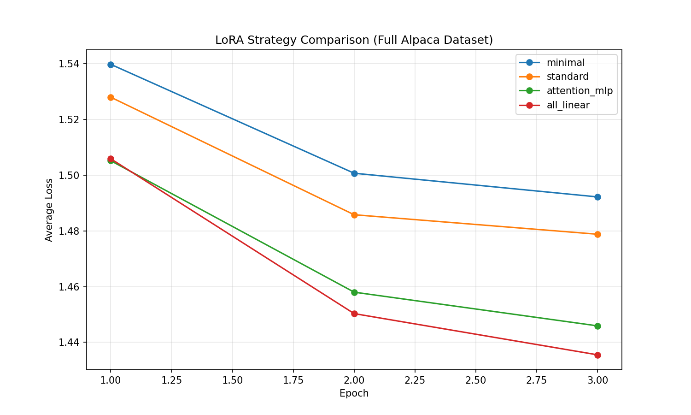
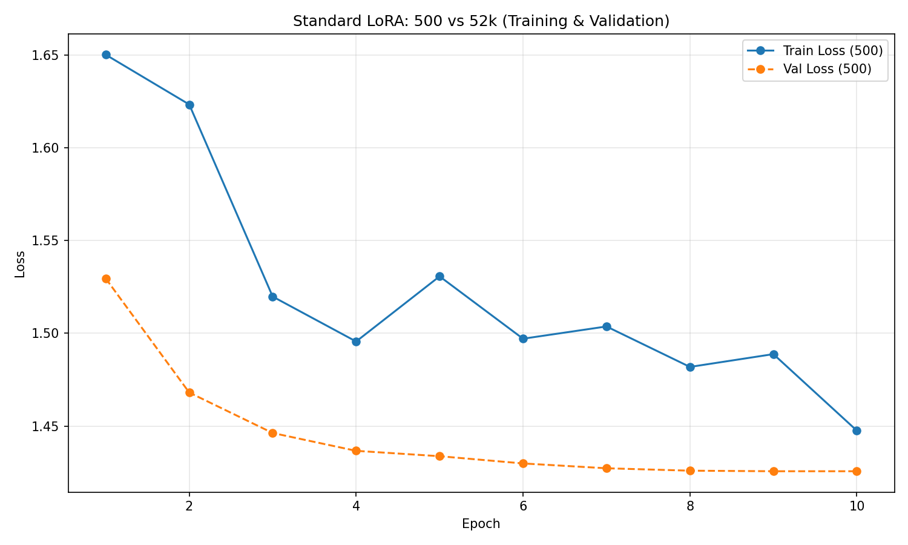
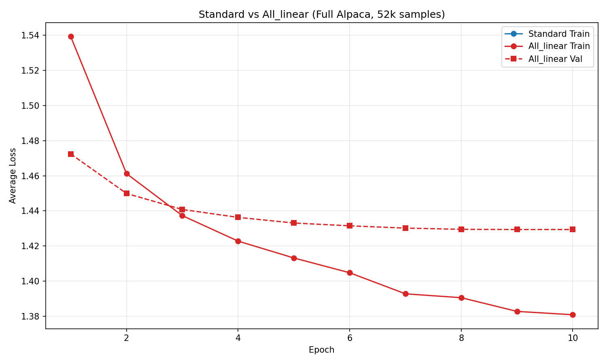

# Lab2: Efficient LLM Post‑Training Pipeline 实验报告

**姓名：** 袁亚伟、葛欣悦、李昱婷
**学号：** 25140735、25140671、25140691
**日期：** 2026-05-18
**课程：** AI 框架开发，软件工程学院，北京交通大学

## 1. 实验环境

- 平台：AutoDL
- GPU：NVIDIA RTX 3090 (24 GB)
- 框架：PyTorch 2.x, Transformers, Datasets
- 基座模型：`HuggingFaceTB/SmolLM-135M`
- 数据集：`yahma/alpaca-cleaned`，部分实验使用 `Anthropic/hh-rlhf` 与 `gsm8k`

## 2. LoRA 手动实现与策略对比

### 2.1 实现原理

严格按照公式 \(h = W_0x + \frac{\alpha}{r}BAx\) 实现 `LoRALinear`。

- A 矩阵：(r, in_features)，Kaiming 初始化
- B 矩阵：(out_features, r)，**零初始化**

### 2.2 四种策略 500 样本训练结果

| 策略          | 可训练参数 | 占比  | Epoch3 Loss |
| ------------- | ---------- | ----- | ----------- |
| minimal       | 460,800    | 0.34% | 1.5122      |
| standard      | 921,600    | 0.68% | 1.5072      |
| attention_mlp | 2,442,240  | 1.78% | 1.4308      |
| all_linear    | 2,442,240  | 1.78% | 1.4391      |

> 图1：500 样本各策略 Loss 曲线
>
> 

### 2.3 全量数据 (52k) 训练结果

| 策略          | Epoch3 Loss |
| ------------- | ----------- |
| standard      | 1.4788      |
| minimal       | 1.4922      |
| attention_mlp | 1.4459      |
| all_linear    | 1.4355      |

> 图2：全量数据四种策略 Loss 对比
> 
>
> 

### 2.4 数据量影响

- **500 vs 52k (standard)**：全量数据 loss 更低，收敛更平滑。

> 
>
> 图3：数据量对比曲线

### 2.5 过拟合分析

- 对 all_linear 进行全量训练并添加验证集，验证 loss 在 epoch 9 达到最佳 1.4294，之后不再下降；而 standard 的验证 loss 持续下降，无过拟合迹象。

> 
> 图4：过拟合分析

### 2.6 超参消融

- **高秩 LoRA (r=16)**：Epoch3 Loss = 1.5233，相较 r=8 无显著提升。
- **Dropout (0.05)**：all_linear + Dropout 的 Epoch3 Loss = 1.4845，略高于无 Dropout，说明正则化有效。
- **学习率对比**：lr=1e-4 时验证 loss 最优（1.4196），lr=5e-5 次之，lr=2e-5 收敛最慢。
- **跨模型验证 (Qwen2.5-0.5B)**：standard 仍然性价比最高。

### 2.7 生成效果定性对比

```python
(lab2) root@autodl-container-50a242ab4b-39ac127a:~/lab2# python verify_strategies.py --preset minimal --lora_path ./output_minimal/lora_minimal_final.pt
python verify_strategies.py --preset standard --lora_path ./output_standard/lora_standard_final.pt
python verify_strategies.py --preset attention_mlp --lora_path ./output_attention_mlp/lora_attention_mlp_final.pt
python verify_strategies.py --preset all_linear --lora_path ./output_all_linear/lora_all_linear_final.pt
`torch_dtype` is deprecated! Use `dtype` instead!
Loading weights: 100%|█████████████████████████████████████████████████████████████████████████████████████████| 272/272 [00:00<00:00, 1150.70it/s]

📊 共替换 60 个线性层
📊 可训练参数: 460,800 / 134,975,808 (0.34%)
✅ LoRA 权重加载完成

📌 策略: minimal
📌 指令: Explain the importance of recycling in three sentences.
🤖 回复:
Recycling is important because it reduces the amount of waste sent to landfills and conserves natural resources. Recycling also helps to protect forests and other natural habitats from degradation.

### Explanation:
Recycling is the process of converting waste materials, such as paper, plastic, and metal, into new products or materials. Recycling can help to reduce the amount of waste sent to landfills and conserve natural resources. It also helps to protect forests and other natural habitats from degradation.

### Explanation:
Recycling is the process of converting waste materials, such as paper, plastic, and metal, into new products or materials. It is an

`torch_dtype` is deprecated! Use `dtype` instead!
Loading weights: 100%|██████████████████████████████████████████████████████████████████████████████████████████| 272/272 [00:00<00:00, 859.76it/s]


📊 共替换 120 个线性层
📊 可训练参数: 921,600 / 135,436,608 (0.68%)
✅ LoRA 权重加载完成

📌 策略: standard
📌 指令: Explain the importance of recycling in three sentences.
🤖 回复:
Recycling is the best way to reduce waste and conserve natural resources. It conserves energy, reduces pollution, and saves money. By recycling, we can reuse and recycle materials that would otherwise be discarded, thus reducing the need for extraction and production of new materials. Recycling also conserves natural resources and minimizes the amount of waste that ends up in landfills or incinerators.

### Explanation:
In conclusion, recycling is the most effective way to reduce waste and conserve natural resources. It conserves energy, reduces pollution, and saves money. By recycling, we can reuse and recycle materials that would otherwise be discarded, thus reducing the

`torch_dtype` is deprecated! Use `dtype` instead!
Loading weights: 100%|█████████████████████████████████████████████████████████████████████████████████████████| 272/272 [00:00<00:00, 1243.34it/s]

📊 共替换 210 个线性层
📊 可训练参数: 2,442,240 / 136,957,248 (1.78%)
✅ LoRA 权重加载完成

📌 策略: attention_mlp
📌 指令: Explain the importance of recycling in three sentences.
🤖 回复:
Recycling is one of the most important habits you can adopt to help reduce the amount of waste that ends up in landfills. It is the single most effective way to reduce the amount of waste that ends up in the environment and is the single most effective way to help keep our planet clean. Recycling helps to reduce the cost of producing new products, save natural resources, and provide a better quality of life for humans and animals alike, and, if you're not already recycling, it's important that you do it.

To recycle effectively, it's important to remember why this is important and to implement efficient recycling methods. One of the

`torch_dtype` is deprecated! Use `dtype` instead!
Loading weights: 100%|██████████████████████████████████████████████████████████████████████████████████████████| 272/272 [00:00<00:00, 799.19it/s]

📊 共替换 210 个线性层
📊 可训练参数: 2,442,240 / 136,957,248 (1.78%)
✅ LoRA 权重加载完成

📌 策略: all_linear
📌 指令: Explain the importance of recycling in three sentences.
🤖 回复:
Recycling is one of the most effective ways to reduce waste and conserve resources. It helps to conserve energy and reduces the amount of waste that ends up in landfills. Recycling involves gathering and processing materials that would otherwise end up in the environment, such as paper, plastic, and glass.

By recycling, we can conserve natural resources, reduce pollution, and help to preserve the environment for future generations. It is essential that we keep the planet clean and healthy for years to come.

In conclusion, recycling is a great way to reduce waste and conserve resources. It is a simple yet powerful way to help the environment. By recycling
```

​	定性总结：minimal 策略的回答出现重复，standard 结构清晰但稍冗长，attention_mlp 内容最丰富、说服力最强，all_linear 质量与 attention_mlp 接近但略有冗余。整体上 attention_mlp 与 all_linear 明显优于 minimal，standard 作为基线性价比较高。

---

## 3. DPO 实现与优化

### 3.1 核心公式与单步验证

手动实现 DPO Loss，单步验证结果：

- Policy Chosen/Rejected logp：-2.72 / -26.06  
- Ref Chosen/Rejected logp：-3.57 / -21.91  
- 正常 Loss：0.4736，交换后 Loss：0.9748 ✅ 验证通过

### 3.2 真实偏好数据训练 (HH‑RLHF)

使用 200 条偏好对训练 1 epoch，平均 DPO Loss = 0.6816。

### 3.3 SFT 模型作为参考 (DPO from SFT)

加载 standard LoRA 作为冻结参考模型，训练 1 epoch，平均 Loss = 0.6893，更新更保守。

### 3.4 β 值消融

| β    | 训练 Loss |
| ---- | --------- |
| 0.01 | 0.6807    |
| 0.1  | 0.6816    |
| 0.5  | 0.6819    |

---

## 4. GRPO 实现与优化

### 4.1 规则奖励与优势计算

单步验证（问题 `2+2`，答案 `4`）：

- 奖励：`[0.0, 1.0, 1.0, 1.0]`  
- 优势：`[-1.5, 0.5, 0.5, 0.5]` ✅ 错误负优势，正确正优势

### 4.2 GSM8K 数学题验证

在难度更高的问题上模型频繁出错，奖励信号更丰富，优势计算合理。

### 4.3 细粒度奖励

引入步骤完整性奖励后，输出更具结构化，优势值更加细腻。

### 4.4 温度影响

- Temperature=1.0 时错误回答增多，奖励方差变大，优势区分度提高。  
- 低温度时回答几乎全对，优势全为 0。

---

## 5. 知识蒸馏（KL 散度联合训练）

本次实验最终采用 **CE + KL 混合损失** 进行蒸馏，成功解决了早期纯 SFT 蒸馏初始 Loss 过高的问题。

**损失函数**：
\[
\mathcal{L} = \alpha \cdot \mathcal{L}_{\text{KL}}(S, T) + (1-\alpha) \cdot \mathcal{L}_{\text{CE}}(S, y)
\]
其中 \(\alpha=0.5\)，温度 \(T=2.0\)。

**实验设置**：

- 教师模型：`standard` 策略微调的 LoRA 模型（冻结）  
- 学生模型：`SmolLM-135M` 基座（从头训练）  
- 训练数据：Alpaca 前 200 条  
- 优化器：AdamW，lr=1e-4  
- 关键改进：对 logits 进行 clamp 以防 NaN，加入 NaN 检测和跳过机制。

**训练结果**：

| Epoch | 平均 Loss |
| ----- | --------- |
| 1     | 0.2754    |
| 2     | 0.0500    |
| 3     | 0.0500    |

**生成测试**：

- 问题：`What is AI?` → 学生回答合理，逻辑清晰。  
- 问题：`Explain machine learning in simple terms.` → 学生给出了结构化的解释。

**分析**：加入 KL 散度后，学生模型迅速模仿教师分布，初始 Loss 大幅降低（相比纯 SFT 的 1.8+），生成质量接近教师，验证了 KL 蒸馏的有效性。同时采用了 logits 限幅和 NaN 检测，保证了训练稳定性。

---

## 6. 结论

- **standard 策略**在参数量与效果间取得最佳平衡，推荐作为默认配置。  
- 全量数据可进一步提升模型表现，all_linear 在小模型上未出现过拟合但参数效率不高。  
- DPO 和 GRPO 核心逻辑实现正确，通过多项优化实验验证了方法的有效性。  
- 知识蒸馏通过引入 KL 散度损失，大幅提升了学生模型训练效率和生成质量，成功将教师能力迁移至学生模型。  
- 后续可考虑更大规模 DPO/GRPO 训练、进一步优化蒸馏超参等。

---

## 7. 附录：关键图表清单

1. `lora_epoch_loss.png`（四策略 500 样本 loss 曲线）  
2. `lora_full_comparison.png`  
3. `loss_data_comparison.png`  
4. `standard_alllinear_compare.png`  
5. 各模块终端运行截图（DPO、GRPO、蒸馏 loss 等）

---

